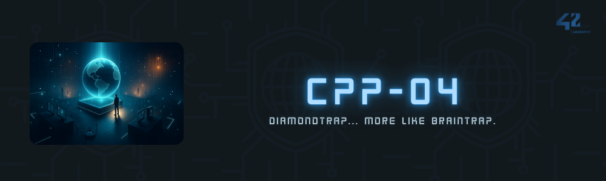

 

---

 

FRENCH VERSION

## Exercice 00 - Polymorphisme

  
Afficher/Masquer

L'exercice 00 consiste à introduire les concepts de base du polymorphisme en C++ à travers une hiérarchie de classes d'animaux, y compris une mise en œuvre délibérément erronée pour illustrer les effets du polymorphisme incorrect.

### Mon implémentation

[Lien ici](https://github.com/aceyzz/CPP04/tree/main/ex00)

#### Classe de base `Animal`
- **Attribut protégé** : `std::string type;` permettant de définir le type d'animal.
- **Méthode** : `makeSound()` affiche un son non spécifique, illustrant le comportement par défaut.

#### Classes dérivées `Dog` et `Cat`
- Héritent de `Animal` et initialisent `type` à "Dog" et "Cat" respectivement.
- **Méthode** : `makeSound()` surchargée pour afficher des sons spécifiques à chaque animal.

#### Classes `WrongAnimal` et `WrongCat`
- Servent à illustrer une mauvaise pratique du polymorphisme.
- `WrongCat` affiche par erreur le son de `WrongAnimal` lorsque le polymorphisme est mal utilisé.

#### Utilisation
- Le fichier `main.cpp` démontre la différence entre les comportements attendus des classes correctement implémentées (`Animal`, `Dog`, `Cat`) et ceux résultant de l'implémentation erronée (`WrongAnimal`, `WrongCat`).
- Les constructeurs et les destructeurs de chaque classe affichent des messages uniques, permettant de suivre le cycle de vie des objets.

### Conclusion

Cet exercice illustre l'importance du polymorphisme en C++ et montre comment une conception soignée des classes et de l'héritage permet d'obtenir des comportements dynamiques attendus. Il met également en évidence les pièges potentiels du polymorphisme lorsqu'il est mal utilisé.

 

## Exercice 01 - Je ne veux pas brûler le monde

  
Afficher/Masquer

L'exercice 01 continue sur le thème du polymorphisme, introduisant la composition avec la classe `Brain` représentant l'intelligence des animaux.

### Mon implémentation

[Lien ici](https://github.com/aceyzz/CPP04/tree/main/ex01)

#### Classe `Brain`
- Contient un tableau de 100 `std::string` pour représenter les idées d'un cerveau.
- Fournit des méthodes pour accéder et modifier ces idées, permettant une gestion détaillée de l'état interne du cerveau.

#### Modifications dans `Dog` et `Cat`
- Chaque `Dog` et `Cat` possède maintenant un pointeur vers un `Brain`, initialisé lors de la construction et détruit lors de la destruction.
- La copie d'un `Dog` ou d'un `Cat` entraîne une copie profonde du `Brain`, assurant l'indépendance des états mentaux entre les instances.

#### Fonctionnement
- Le `main.cpp` démontre la création, la manipulation, et la destruction d'objets `Animal`, `Dog`, et `Cat`, avec une attention particulière à la gestion de la mémoire et au polymorphisme.
- Les tests incluent la vérification du comportement de copie profonde pour les classes `Dog` et `Cat`, s'assurant que les cerveaux sont correctement clonés.

### Conclusion

Cet exercice approfondit la compréhension du polymorphisme et de la composition en C++, mettant en évidence les défis liés à la gestion de la mémoire et à l'indépendance des états entre les instances. La mise en œuvre de la copie profonde est essentielle pour maintenir l'intégrité de l'état interne lors de la copie d'objets complexes.

 

## Exercice 02 - Classe abstraite

  
Afficher/Masquer

L'exercice 02 transforme la classe `Animal` en une classe abstraite pour éviter son instanciation directe, renforçant le concept de polymorphisme en C++.

### Mon implémentation

[Lien ici](https://github.com/aceyzz/CPP04/tree/main/ex02)

#### Modifications clés
- La fonction `makeSound()` dans la classe `Animal` est désormais purement virtuelle (`= 0`), ce qui rend `Animal` abstraite et non instanciable directement.
- Les classes `Dog` et `Cat` implémentent leur propre version de `makeSound()`, permettant de conserver un comportement spécifique à chaque animal.

#### Classe `Brain`
- La gestion du cerveau (`Brain`) reste inchangée, chaque `Dog` et `Cat` possédant son propre `Brain` pour stocker ses idées.

#### Tests
- Le fichier `main.cpp` démontre la création et la manipulation d'objets `Dog` et `Cat` à travers des pointeurs de type `Animal`, suivant le principe du polymorphisme.
- Des tests supplémentaires vérifient la copie profonde des objets `Dog` et `Cat`, s'assurant que le clonage est effectué correctement pour `Brain`.

### Conclusion

Cet exercice illustre l'importance des classes abstraites dans la conception de hiérarchies d'objets et renforce le concept de polymorphisme. En empêchant l'instanciation directe de `Animal`, on garantit que seuls les objets bien définis avec un comportement spécifique peuvent être créés, évitant ainsi les erreurs potentielles et renforçant la robustesse du code.

 

## Exercice 03 - Interface & Récap (Bonus)

  
Afficher/Masquer

L'exercice 03 du module C++ sur le polymorphisme par sous-typage, les classes abstraites, et les interfaces demande d'implémenter un système de gestion de materias inspiré de jeux comme Final Fantasy. Voici un résumé des exigences et concepts clés à maîtriser pour cet exercice.

#### Objectifs Principaux:

1. **AMateria Classe de Base Purement Abstraite:**
   - `AMateria` sert de classe de base pour les types de materias spécifiques comme `Ice` et `Cure`.
   - Elle doit contenir au moins une méthode purement virtuelle `clone()` qui force les classes dérivées à implémenter un mécanisme de clonage.

2. **Implémentation des Materias Spécifiques:**
   - Les classes `Ice` et `Cure` doivent être concrètes et hériter de `AMateria`.
   - Elles implémentent la méthode `clone()` retournant une nouvelle instance du même type.
   - La méthode `use()` doit afficher un message spécifique à chaque type de materia en agissant sur un personnage cible.

3. **La Classe Character:**
   - Implémente l'interface `ICharacter`.
   - Gère un inventaire de jusqu'à 4 `AMateria` objets.
   - Fournit des mécanismes pour équiper, déséquiper (sans supprimer), et utiliser les materias sur des cibles.
   - La copie d'un `Character` est profonde, incluant des copies profondes de toutes les materias équipées.

4. **Gestion de MateriaSource:**
   - La classe `MateriaSource` implémente l'interface `IMateriaSource`.
   - Peut apprendre jusqu'à 4 types de materias, permettant de créer de nouvelles instances de ces materias par le nom.
   
5. **Principes de Conception:**
   - Utilisation du polymorphisme pour gérer divers types de materias à travers un type de base commun.
   - Démonstration du concept d'interface en C++ via des classes purement abstraites.
   - Gestion appropriée de la mémoire, notamment lors de la copie profonde et de la suppression d'objets pour éviter les fuites de mémoire.

#### Exemple d'Exécution:

Le code principal montre comment créer des sources de materias, apprendre de nouvelles materias, les créer par nom, les équiper sur des personnages, et les utiliser. Il illustre l'interaction entre différents composants du système de materias et met en évidence l'utilisation du polymorphisme et des interfaces pour construire un cadre extensible pour les objets de jeu.

#### Conclusion:

Cet exercice avancé combine plusieurs concepts clés de la programmation orientée objet en C++ pour construire un système complexe mais flexible de gestion des materias, en mettant l'accent sur la conception d'interface, le polymorphisme, et la gestion correcte de la mémoire.

### REMARQUE
~~Mon implémentation pour cet exercice avec des leaks de mémoires dans certains tests spécifiques. Je revendrais très certainement dessus prochainement. Le code est disponible sur l'un des commits pour les plus curieux.~~

[12.03.2024] Fixed ! Les leaks de mémoire provenaient du fait que la fonction membre `unequip()` perdait la trace (sans le `delete`) du `AMateria*` qu'elle enlevait de son inventaire. Donc, j'ai implémenter une fonction `getMateria(int idx)` qui permet de recuperer le pointeur et le stocker (dans le `main`) avant de l'`unequip()`. Ceci permet donc de le supprimer proprement a la fin du programme, ou bien de le réassigner au besoin.

 

---

 

ENGLISH VERSION

## Exercise 00 - Polymorphism

	
Show/Hide

Exercise 00 introduces the basic concepts of polymorphism in C++ through a hierarchy of animal classes, including a deliberately flawed implementation to illustrate the effects of incorrect polymorphism.

### My Implementation

[Link here](https://github.com/aceyzz/CPP04/tree/main/ex00)

#### Base Class `Animal`
- **Protected Attribute**: `std::string type;` to define the type of animal.
- **Method**: `makeSound()` outputs a non-specific sound, illustrating default behavior.

#### Derived Classes `Dog` and `Cat`
- Inherit from `Animal` and initialize `type` to "Dog" and "Cat" respectively.
- **Method**: `makeSound()` is overridden to output specific sounds for each animal.

#### Classes `WrongAnimal` and `WrongCat`
- Serve to illustrate bad practices in polymorphism.
- `WrongCat` mistakenly outputs the sound of `WrongAnimal` when polymorphism is misused.

#### Usage
- The `main.cpp` file demonstrates the difference between the expected behaviors of properly implemented classes (`Animal`, `Dog`, `Cat`) and those resulting from the flawed implementation (`WrongAnimal`, `WrongCat`).
- Constructors and destructors of each class output unique messages, allowing tracking of the object lifecycle.

### Conclusion

This exercise highlights the importance of polymorphism in C++ and shows how careful class and inheritance design can achieve expected dynamic behaviors. It also emphasizes the potential pitfalls of polymorphism when misused.

 

## Exercise 01 - I Don't Want to Burn the World

	
Show/Hide

Exercise 01 continues the theme of polymorphism, introducing composition with the `Brain` class representing the intelligence of animals.

### My Implementation

[Link here](https://github.com/aceyzz/CPP04/tree/main/ex01)

#### Class `Brain`
- Contains an array of 100 `std::string` to represent a brain's ideas.
- Provides methods to access and modify these ideas, enabling detailed management of the brain's internal state.

#### Changes in `Dog` and `Cat`
- Each `Dog` and `Cat` now has a pointer to a `Brain`, initialized during construction and destroyed during destruction.
- Copying a `Dog` or `Cat` results in a deep copy of the `Brain`, ensuring independence of mental states between instances.

#### Functionality
- The `main.cpp` demonstrates the creation, manipulation, and destruction of `Animal`, `Dog`, and `Cat` objects, with particular attention to memory management and polymorphism.
- Tests include verifying deep copy behavior for `Dog` and `Cat` classes, ensuring brains are properly cloned.

### Conclusion

This exercise deepens the understanding of polymorphism and composition in C++, highlighting challenges related to memory management and state independence between instances. Implementing deep copy is essential to maintain the integrity of internal states when copying complex objects.

 

## Exercise 02 - Abstract Class

	
Show/Hide

Exercise 02 transforms the `Animal` class into an abstract class to prevent its direct instantiation, reinforcing the concept of polymorphism in C++.

### My Implementation

[Link here](https://github.com/aceyzz/CPP04/tree/main/ex02)

#### Key Changes
- The `makeSound()` function in the `Animal` class is now purely virtual (`= 0`), making `Animal` abstract and non-instantiable directly.
- The `Dog` and `Cat` classes implement their own version of `makeSound()`, preserving specific behavior for each animal.

#### Class `Brain`
- The management of the `Brain` remains unchanged, with each `Dog` and `Cat` having its own `Brain` to store ideas.

#### Tests
- The `main.cpp` file demonstrates the creation and manipulation of `Dog` and `Cat` objects through `Animal` pointers, following the principle of polymorphism.
- Additional tests verify the deep copy of `Dog` and `Cat` objects, ensuring proper cloning of `Brain`.

### Conclusion

This exercise illustrates the importance of abstract classes in designing object hierarchies and reinforces the concept of polymorphism. By preventing the direct instantiation of `Animal`, only well-defined objects with specific behavior can be created, avoiding potential errors and strengthening code robustness.

 

## Exercise 03 - Interface & Recap (Bonus)

	
Show/Hide

Exercise 03 of the C++ module on subtype polymorphism, abstract classes, and interfaces requires implementing a materia management system inspired by games like Final Fantasy. Here is a summary of the requirements and key concepts to master for this exercise.

#### Main Objectives:

1. **AMateria Purely Abstract Base Class:**
	 - `AMateria` serves as the base class for specific materia types like `Ice` and `Cure`.
	 - It must contain at least one pure virtual method `clone()` that forces derived classes to implement a cloning mechanism.

2. **Implementation of Specific Materias:**
	 - The `Ice` and `Cure` classes must be concrete and inherit from `AMateria`.
	 - They implement the `clone()` method, returning a new instance of the same type.
	 - The `use()` method should display a message specific to each materia type when acting on a target character.

3. **The `Character` Class:**
	 - Implements the `ICharacter` interface.
	 - Manages an inventory of up to 4 `AMateria` objects.
	 - Provides mechanisms to equip, unequip (without deleting), and use materias on targets.
	 - Copying a `Character` involves deep copying all equipped materias.

4. **MateriaSource Management:**
	 - The `MateriaSource` class implements the `IMateriaSource` interface.
	 - Can learn up to 4 types of materias, allowing the creation of new instances of these materias by name.
	 
5. **Design Principles:**
	 - Use polymorphism to manage various materia types through a common base type.
	 - Demonstrate the concept of interfaces in C++ via purely abstract classes.
	 - Proper memory management, especially during deep copying and object deletion, to avoid memory leaks.

#### Example Execution:

The main code demonstrates how to create materia sources, learn new materias, create them by name, equip them on characters, and use them. It illustrates the interaction between different components of the materia system and highlights the use of polymorphism and interfaces to build an extensible framework for game objects.

#### Conclusion:

This advanced exercise combines several key concepts of object-oriented programming in C++ to build a complex yet flexible materia management system, emphasizing interface design, polymorphism, and proper memory management.

### NOTE
~~My implementation for this exercise had memory leaks in certain specific tests. I will revisit it soon. The code is available in one of the commits for the curious.~~

[12.03.2024] Fixed! The memory leaks were caused by the `unequip()` member function losing track (without `delete`) of the `AMateria*` it removed from the inventory. I implemented a `getMateria(int idx)` function to retrieve the pointer and store it (in `main`) before calling `unequip()`. This allows proper deletion at the end of the program or reassignment if needed.

